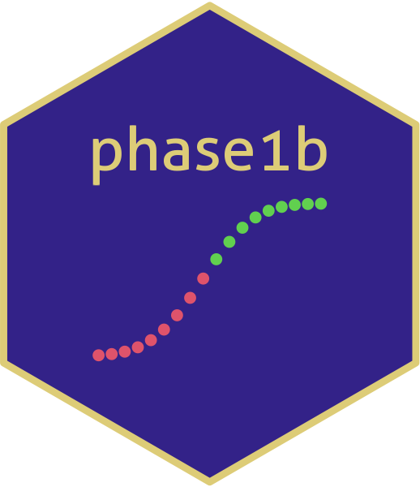

# presentations2024 

## The following are talks and abstracts of those I presented 2024
|Year|Month                        |Date  |Firm                                         |Talk                                                                                                                                                  |
|----|-----------------------------|------|---------------------------------------------|------------------------------------------------------------------------------------------------------------------------------------------------------|
|2024|Jan                          |25    |Roche                                        |Julia Basel Course (Data Science, Machine Learning, Quarto)                                                                                           |
|2024|June                         |13    |Roche                                        |Julia Basel Course (Data Science, Machine Learning, Quarto)                                                                                           |
|2024|March                        |5     |Roche                                        |QTRLY- DSS "HOPE" POD ALL Hands: Dose Escalation                                                                                               |
|2024|March                        |18    |Roche                                        |Our dose escalation trial Journey in OCEAN                                                                                              |
|2024|March                        |21    |Roche                                        |Our dose escalation trial Journey in OCEAN                                                                                              |
|2024|June                         |18    |PSI                                          |A Bayesian Framework for decision making in early development                                                                                         |
|2024|June                         |9     |useR! Salzburg                               |A Statistician's journey in Statistical Software Engineering                                                                                          |
|2024|July                         |10    |useR! Salzburg                               |Keynote : A(R)t is the Engine for Change                                                                                                              |
|2024|July                         |10    |useR! Salzburg                               |A Bayesian Framework for decision making in early development                                                                                         |
|2024|Sept                         |9     |Roche                                        |Basel Biostats Forum : [expanded] A Bayesian Framework for decision making in early development                                                       |
|2024|Sept                         |16    |Roche                                        |Statistical Software Engineering : A Statistician‚ A technical journey in R                                                                          |
|2024|Sept                         |18    |PHUSE                                        |Gearing Statisticians up for Software Successs                                                                                                        |
|2024|Sept                         |19    |UCB                                          |[expanded] A Bayesian Framework for decision making in early development A Bayesian Framework for decision making in early development                |
|2024|Sept                         |19    |Genentech SSF                                |Statistical Software Engineering : A Statistician‚ A technical journey in R                                                                          |
|2024|Oct                          |29    |R/Pharma                                     |Gearing Statisticians up for Software Successs                                                                                                        |
|2024|Oct                          |30    |R/Pharma                                     |[expanded] A Bayesian Framework for decision making in early development                                                                              |
|2024|Nov                          |12    |Effective Statistician                       |[expanded] A Bayesian Framework for decision making in early development                                                                              |
|2024|Dec                          |12    |BMS                                          |[expanded] A Bayesian Framework for decision making in early development                                                                              |
|2024|Dec                          |13    |Uni Basel                                    |Applied Mathematics in Drug and Career Discovery                                                                                                      |
|2025|March                        |24    |DAGStat                                      |Practical Bayesian Statistics : A gentle refresher on probability theory, Bayesian Framework and Intuition for effective application in Biostatistics.|

### by the way, This HEX sticker was voted at the PSI 2024! Thank you all! And nice one : )

**A Bayesian approach to decision making in early development clinical trials : An R solution.**	

Early clinical trials play a critical role in Oncology drug development. The main purpose of early trials is to determine whether a novel treatment demonstrates sufficient safety and efficacy signals to warrant further investment (Lee & Liu, 2008). The new open source R package phase1b (Yeo et al, 2024) is a flexible toolkit that calculates many properties to this end, especially in the oncology therapeutic area. The primary focus of this package is on binary endpoints. The benefit of a Bayesian approach is the possibility to account for prior data (Thall & Simon, 1994) in that a new drug may have shown some signals of efficacy owing to its proposed mode of action, or similar activity based on prior data. The concept of the phase1b package is to evaluate the posterior probability that the response rate with a novel drug is better than with the current standard of care treatment in early phase trials such as Phase I. The phase1b package provides a facility for early development study teams to decide on further development of a drug either through designing for phase 2 or 3, or expanding current cohorts. The prior distribution can incorporate any previous data via mixtures of beta distributions. Furthermore, based on an assumed true response rate if the novel drug was administered in the wider population, the package calculates the frequentist probability that a current clinical trial would be stopped for efficacy or futility conditional on true values of the response, otherwise known as operating characteristics. The intended user is the early clinical trial statistician in the design and interim stage of their study and offers a flexible approach to setting priors and weighting.

**Statistical Software Engineering : A Statistician’s technical journey in R.**

The distinction between applied statistician and statistical software engineer seem to only be clear in job titles. The reality is that applied statisticians write software and are well placed to do so owing to their vast industry-specific insights and proximity to real world problems. The common language of R amongst applied statisticians especially in the Pharma space have started some early conversations about incorporating software engineering competence in an applied statistician’s already impressive toolbox. I share my personal experience to this end:

I present my one year anniversary of my journey of transitioning into a Statistical Software Engineer in R. I especially elaborate on my learnings and challenges whilst being on this new technical journey and what skills, knowledge and competences are needed to bring an already available internal product to an open source state of art software called phase1b (Yeo et al, 2024). As a trained clinical study statistician, I observed that Statistical Software development benefits from the transferable skills beyond that of statistical reasoning. It requires an open mind, focus, creativity and an ability to communicate science to a diverse audience. I will share my journey in learning how to speak to the user via documentation, create and evaluate robust function calls through rigorous unit and integrative testing and how I did draw from my industry experience as a clinical trial statistician, to precisely provide acute examples that mirror the industry specific questions facing today’s promising novel drugs. Further to that, I expand on valuable learnings and challenges to my growth as a statistical software engineer and where I now feel as a methodologist, after one year of software engineering. Lastly, I will share why I believe statistical software engineering has the potential to pave the way for novel statistical methods by creating products that speak to its users.

**Gearing our industry Statisticians up for Software success : A phase1b journey.**

Trial statisticians write software and are well placed to contribute to analytical solutions that inform business and clinical decision making. Early conversations about incorporating software engineering competence in a trials statistician’s (Sabanés Bové, 2023) already impressive toolbox have started to emerge with the use of the common language of R. I share my personal experience about the actions and attitudes to achieve a state-of-art solution called phase1b and highlight good software engineering principles and ways of working. The package phase1b (Yeo et al, 2024)  is a flexible toolkit that evaluates efficacy and futility analysis within the Bayesian framework for early Oncology trials. The R package informs decision making on whether the drug of concern warrants further investment. Since the evaluation of the efficacy and futility impacts business and clinical decisions in pharma, it is advantageous that the industry strives to understand and create the conditions for more Software success such as the phase1b.		
				 	 	 		
_References_

Yeo, A T, Sabanés Bové D, Elze M, Pourmohamad T, Zhu J, Lymp J, Teterina A (2024).
Phase1b : Calculations for decisions on Phase 1b clinical trials. R package
version 1.0.0, < https://genentech.github.io/phase1b>
(To be published prior to conference)

Sabanés Bové D (2023), Why we Need to Improve Software Engineering in Biostatistics - A Call to Action, 
R Pharma Keynote <https://rinpharma.com/post/2023-10-03-keynotes/>
